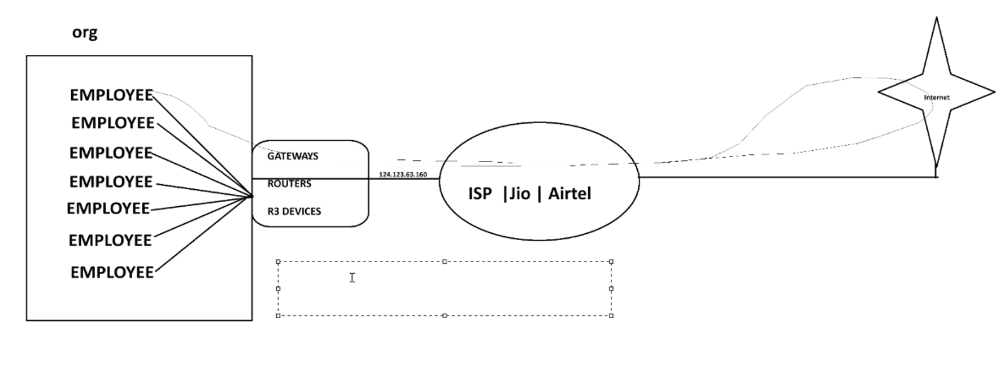

# 🌐 IP Addressing

Each and every device needs the IP address for communication.

## 🔢 Types: => 2
1. **IPv4** ➡️ 16 characters with 4 divisions separated by ":"  
   📍 *Start Range:* `0.0.0.0`  
   📍 *End Range:* `255.255.255.255`  
   📌 *(e.g., short phoneNumber)*

2. **IPv6** ➡️ 24 characters with 6 divisions separated by ":"

---

## 📡 IPv4 
👉 Use `ping` command to find the IP of a particular URL  
📌 Example: `ping www.google.com`  
🔍 *This will return an IP address like:* `142.250.195.36`

---

## 🗂️ Classes: A B C D E  
💡 **Hint:** "1st address and last address for host named as Broadcast"

### 🅰️ Class A  
- Range: `1.0.0.0` to `126.255.255.255`  
- Usage: **Large Networks**  
- 📍 `127.x.x.x` is **Loopback Address** → it pings its own device  
  📌 Example: `ping 127.0.0.1`

### 🅱️ Class B  
- Range: `128.0.0.0` to `191.255.255.255`  
- Usage: **Medium Networks**

### 🌐 Class C  
- Range: `192.0.0.0` to `223.255.255.255`  
- Usage: **Local Area Networks (LAN)**

### 🛰️ Class D  
- Range: `224.0.0.0` to `239.255.255.255`  
- Reserved for **Multicasting**

### 🧪 Class E  
- Range: `240.0.0.0` to `255.255.255.254`  
- Reserved for **Experimental purposes**

💡 *Classes A, B, and C depend on the size and requirements of the network.*

---

## 💰 AWS Charging Note
AWS is charging for IPv4 because at some point it may become **exhausted**.  
📘 So, **RFC1918** came up with a formula → **Private and Public IPs**

---

## 🔐 Private IPs (Used in office environments)

🛜 These are used internally and translated to Public IPs for external communication.

- `10.0.0.0` - `10.255.255.255` (🔑 10/8 prefix)  
- `172.16.0.0` - `172.31.255.255` (🔑 172.16/12 prefix)  
- `192.168.0.0` - `192.168.225.255` (🔑 192.168/16 prefix)

📌 Example in Offices:  
A router may assign `192.168.1.2` to your laptop.

📌 Example in AWS EC2:  
You might see `10.0.1.15` as the private IP of an instance.

---

# 🌐 Network Address Translation (NAT)



### 🛠️ Process:

- Within an organization, employees use systems with **Private IPs**.
- These IPs go through **Gateways/Routers/R3 Devices**.
- These devices have **Public IPs** that connect to **Internet Service Providers** like **Jio, Airtel**, etc.
- They retrieve information from the internet and follow the **same path back** to the system.

---

# 🛡️ VPC (Virtual Private Cloud)

- A **private network** for your **regional resources**.
- Contains **Subnets** that allow you to partition your network into:
  - 🌐 **Public Subnet**
  - 🔒 **Private Subnet**
- Subnets are **availability zone-based** resources.

---

# 📏 CIDR (Classless Inter-Domain Routing) - Private IPs

- Defines the **IP range** in a format that is computer-understandable.
- 📌 **Example:** `10.0.0.0/24` ➝ IP range: `10.0.0.0` to `10.0.0.255`

### 📉 CIDR Breakdown:

| CIDR         | Range                          | Total IPs |
|--------------|--------------------------------|-----------|
| 10.0.0.0/32  | 10.0.0.0                        | 1         |
| 10.0.0.0/31  | 10.0.0.0 - 10.0.0.1             | 2         |
| 10.0.0.0/30  | 10.0.0.0 - 10.0.0.3             | 4         |
| 10.0.0.0/29  | 10.0.0.0 - 10.0.0.7             | 8         |
| 10.0.0.0/28  | 10.0.0.0 - 10.0.0.15            | 16        |
| 10.0.0.0/27  | 10.0.0.0 - 10.0.0.31            | 32        |
| 10.0.0.0/26  | 10.0.0.0 - 10.0.0.63            | 64        |
| 10.0.0.0/25  | 10.0.0.0 - 10.0.0.127           | 128       |
| 10.0.0.0/24  | 10.0.0.0 - 10.0.0.255           | 256       |

### 🔢 Formula:

> `Total IPs = 2^(32 - CIDR)`
- Example: `190.20.5.0/27` ➝ `2^(32-27)` = `2^5` = `32 IPs`
- Example: `10.0.0.0/26` ➝ `2^6 = 64 IPs`

### 🧮 Multi-Subnet Range:

- `/23` ➝ 10.0.0.0 - 10.0.1.255 (512 IPs)
- `/22` ➝ 10.0.0.0 - 10.0.3.255 (1024 IPs)

### 🌍 Larger Ranges:

| CIDR        | Range                             | Total IPs     |
|-------------|-----------------------------------|---------------|
| 10.0.0.0/24 | 10.0.0.0 - 10.0.0.255              | 256           |
| 10.0.0.0/16 | 10.0.0.0 - 10.0.255.255            | 65,536        |
| 10.0.0.0/8  | 10.0.0.0 - 10.255.255.255          | 16,777,216    |

---

# 🌐 Public IP vs 🔒 Private IP

| Feature              | Public IP 🌍                | Private IP 🏢                     |
|----------------------|-----------------------------|-----------------------------------|
| Accessibility        | Accessible from anywhere     | Only within organization's VPC    |
| Use Case             | Web Servers, DNS, etc.       | Databases, internal systems       |

---

# 🏗️ 2-Tier vs 3-Tier Architecture

## 🧱 2-Tier Architecture:
```
Browser
   │
   ▼
 DNS (Route 53)
   │
   ▼
Load Balancer (ELB)
   │
   ▼
Web Server (Apache on EC2)
   │
   ▼
Database (EC2, RDS, or DynamoDB)

S3 ➝ Web Server (for static content)
```

## 🧱 3-Tier Architecture:
```
Client (Browser)
   │
   ▼
DNS (Route 53)
   │
   ▼
Load Balancer (ELB)
   │
   ▼
Application Tier (EC2 - Node.js/Spring Boot)
   │
   ▼
Web Server Tier (Apache/Nginx)
   │
   ▼
Database Tier (RDS, EC2-DB, or DynamoDB)

S3 ➝ Web Server Tier (for static content)
```

---

# 📚 Why Learn VPC?

- In **2-tier architecture**, both **web server** and **database** are involved.
- The **web server** should have **both public and private IPs** for global access.
- The **database** should use only **private IPs** for security.
- 🔐 **This architecture ensures that databases are only accessible through the web server**, not directly from the internet.

---

